# UdaPeople

This project should help you to master CI/CD concepts. The detailed description can be found in [Introduction](instructions/Instructions.md).

## Project Submission Items
### Presentation
The following [slides](./presentation.pdf) explain the key benefits of CI/CD for Cloud-based software products.

### Urls
- Public Url to GitHub repository [URL01]
  - https://github.com/OlgaLyudchik/udacity-cloud-devops-project-udapeople

- Public URL for the S3 Bucket (the green candidate frontend) [URL02]
  - http://udapeople-f92c214.s3-website-us-west-2.amazonaws.com/index.html

- Public URL for the CloudFront distribution (the blue production frontend) [URL03]
  - d1lhzqzgkfq7e8.cloudfront.net

- Public URLs to deployed application backend in EC2 [URL04]
  - ec2-34-216-61-0.us-west-2.compute.amazonaws.com
  - http://ec2-34-216-61-0.us-west-2.compute.amazonaws.com:9100/metrics

- Public URL to the Prometheus server [URL05]
  - http://ec2-54-202-177-103.us-west-2.compute.amazonaws.com:9090

### Screenshots
1. Backend build failed: 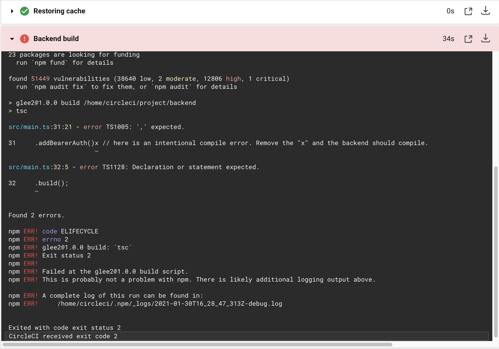
2. Backend test failed: 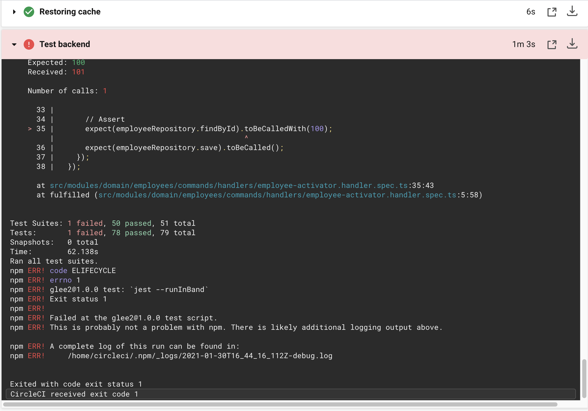
3. Backend scan failed: 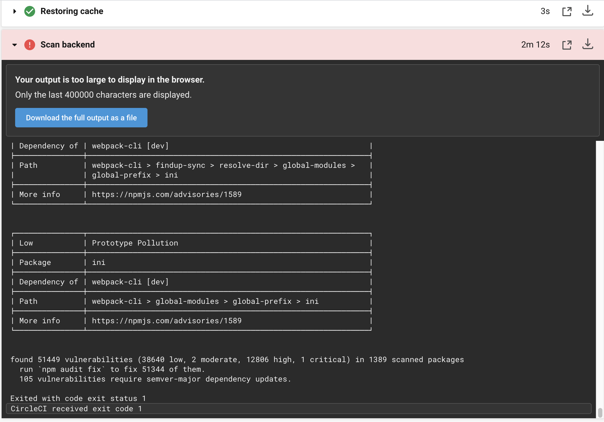
4. Slack CircleCI integration: 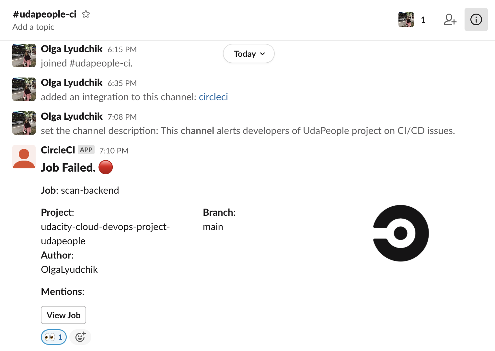
5. Deploy backend infrastructure failed: 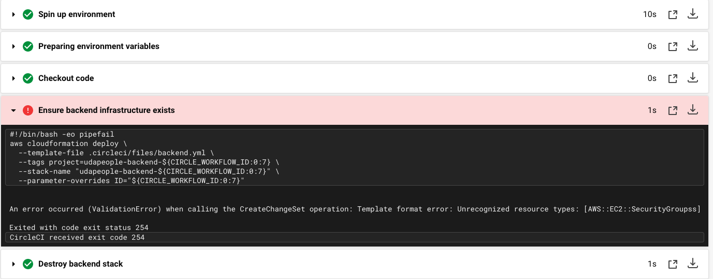
6. Frontend smoke test failed: 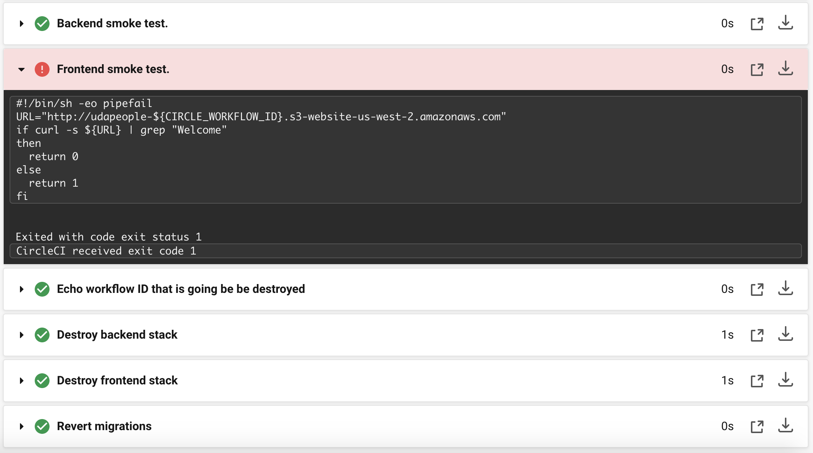
7. Rollback after failed smoke test succeeded: 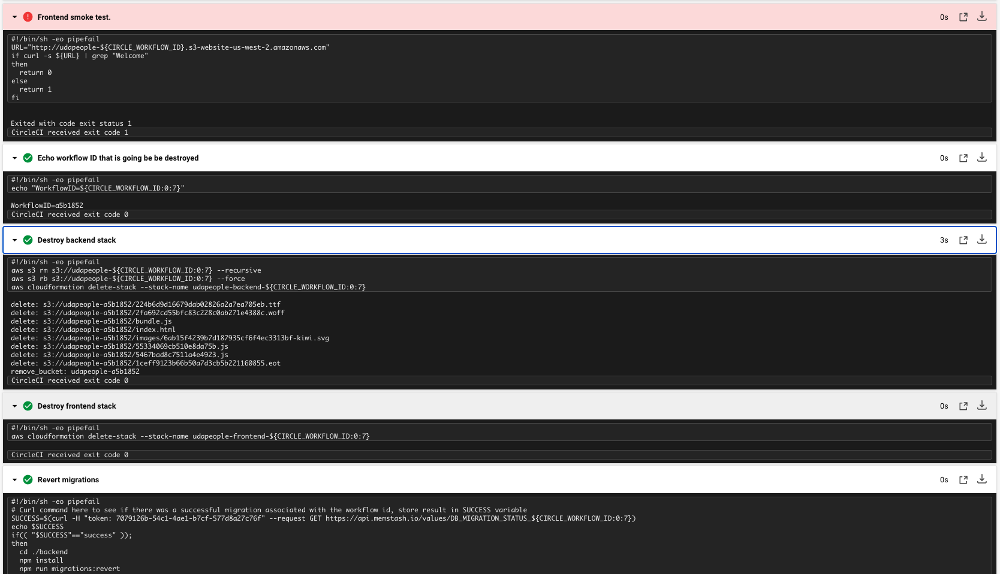
8. Promotion of infrastructure succeeded: 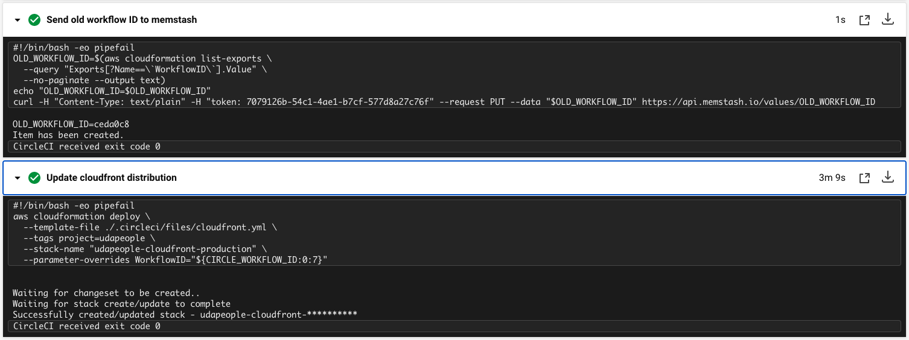
9. Cleanup old stack succeeded: 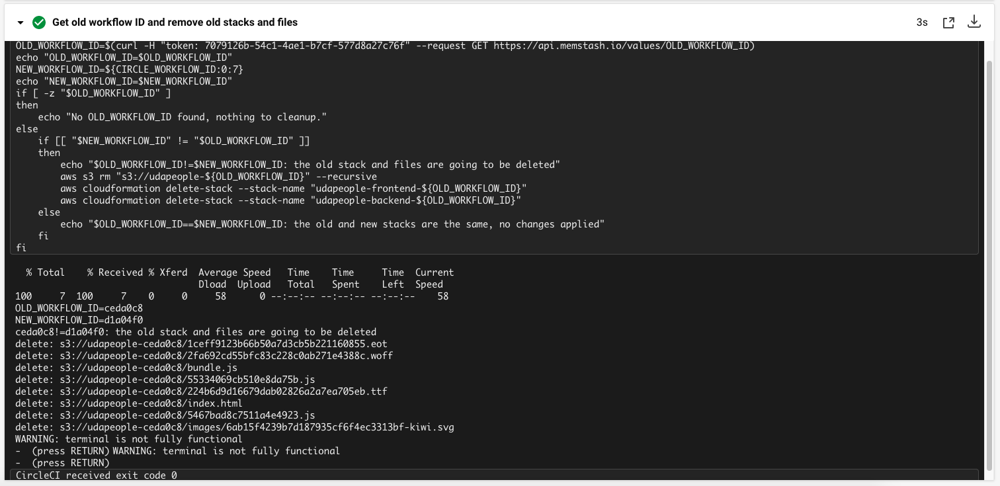
10. Skip deployment for non-`main` branch: 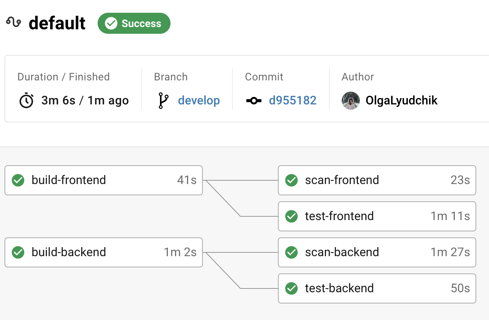
11. Graphs for backend EC2 server that monitor disk I/O, available memory, available disk space, and CPU usage.
    1. Disk I/O 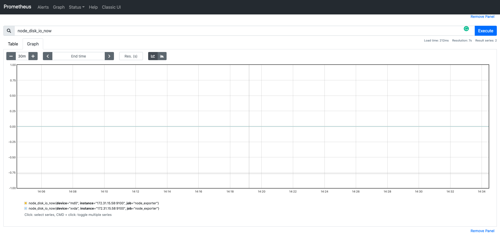
    2. Available memory 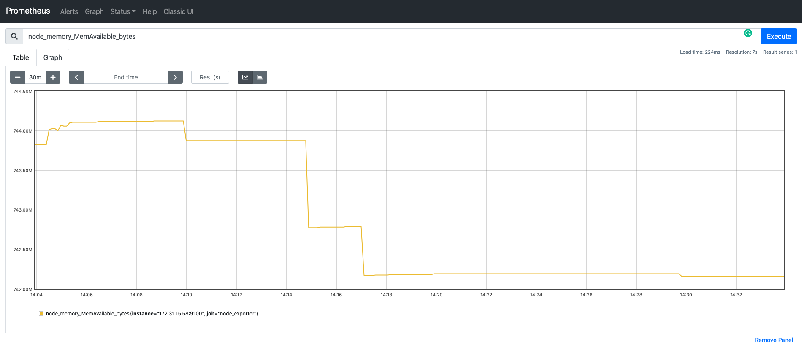
    3. CPU usage 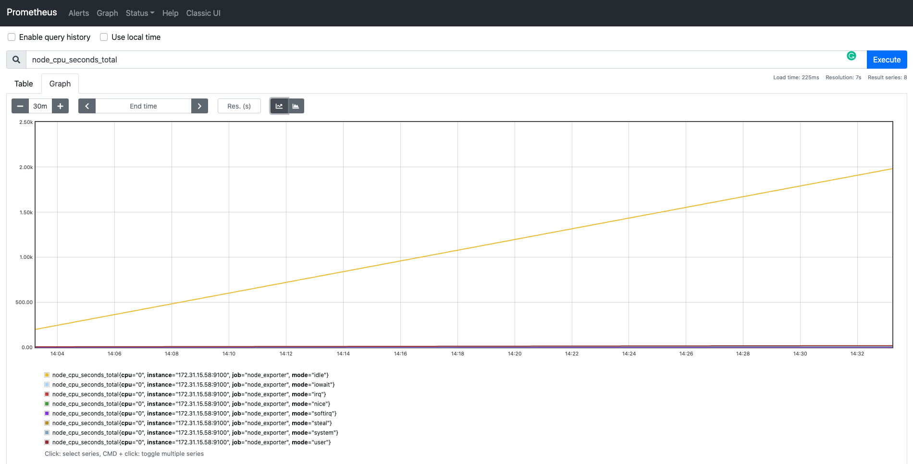
12. Slack Prometheus integration: 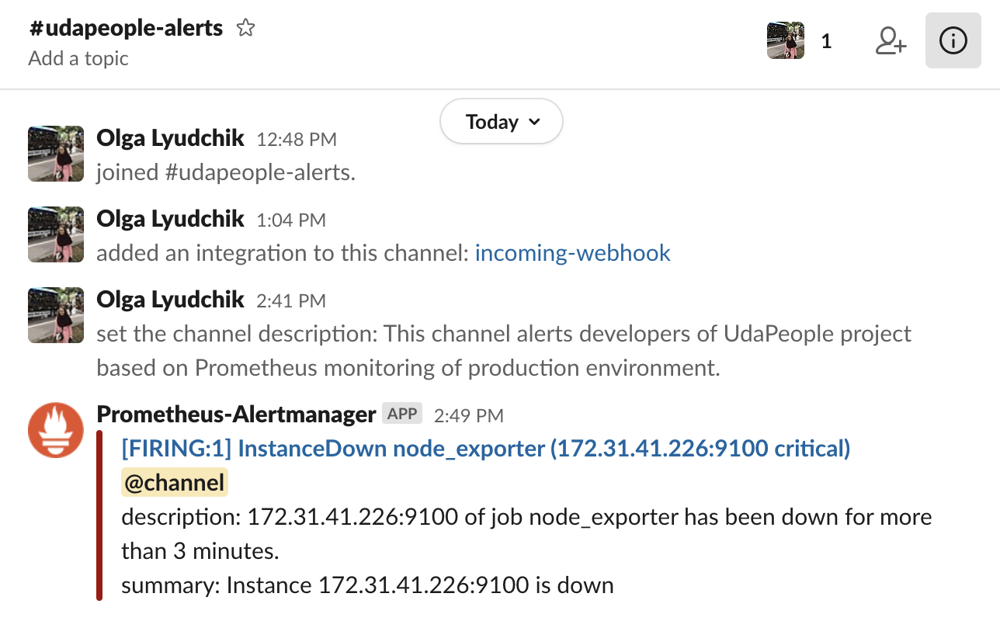
